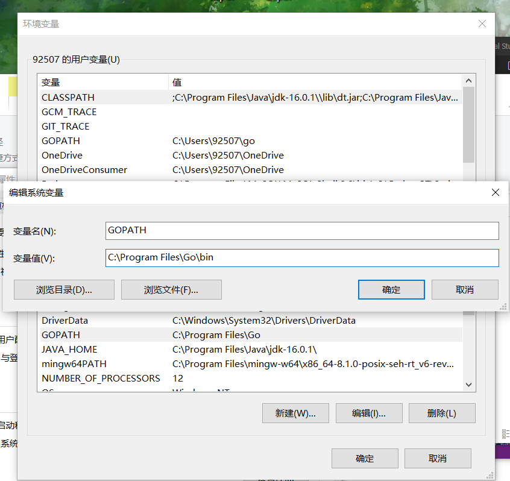
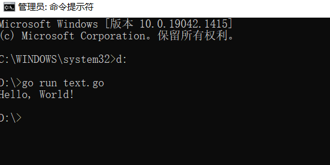
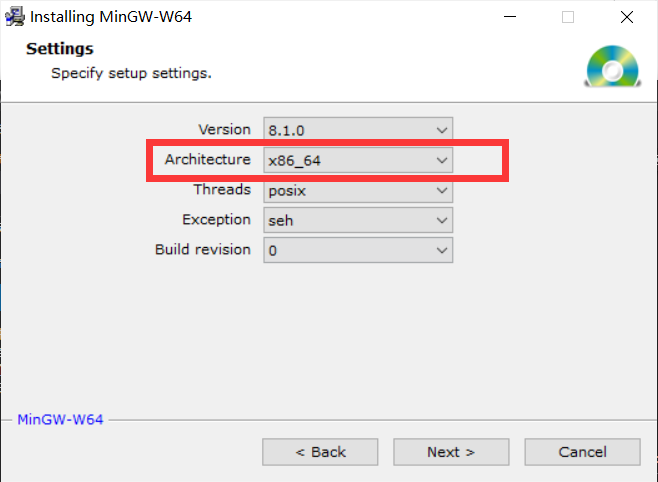
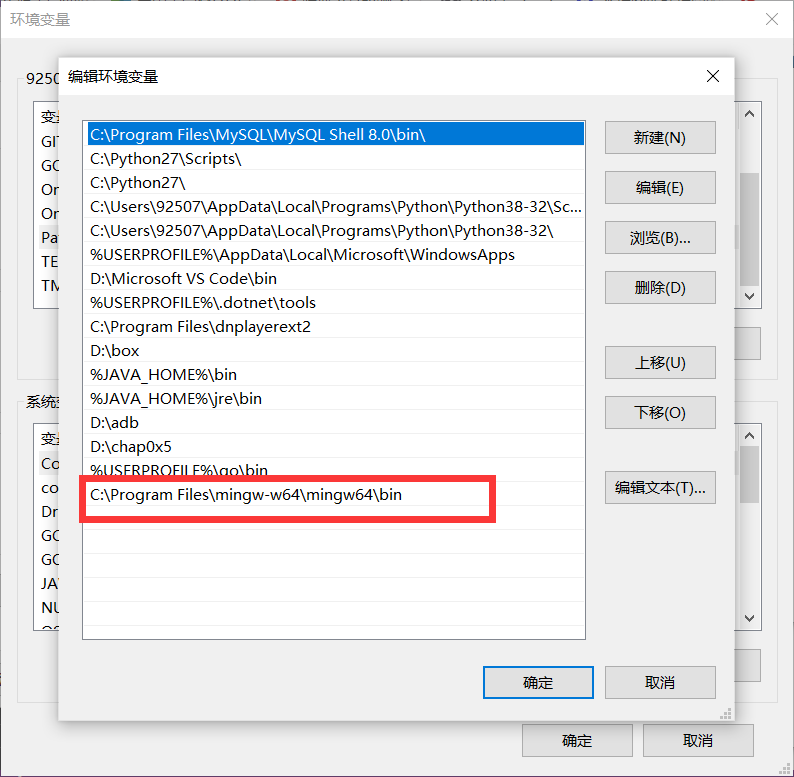
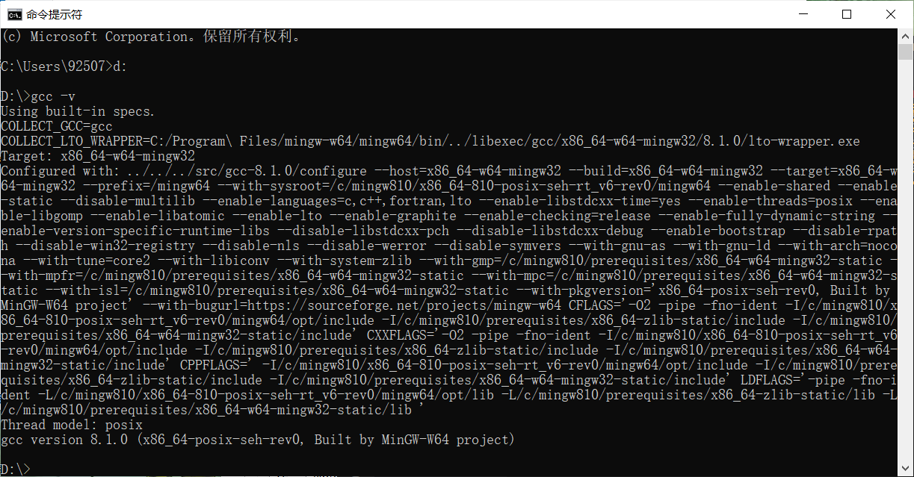
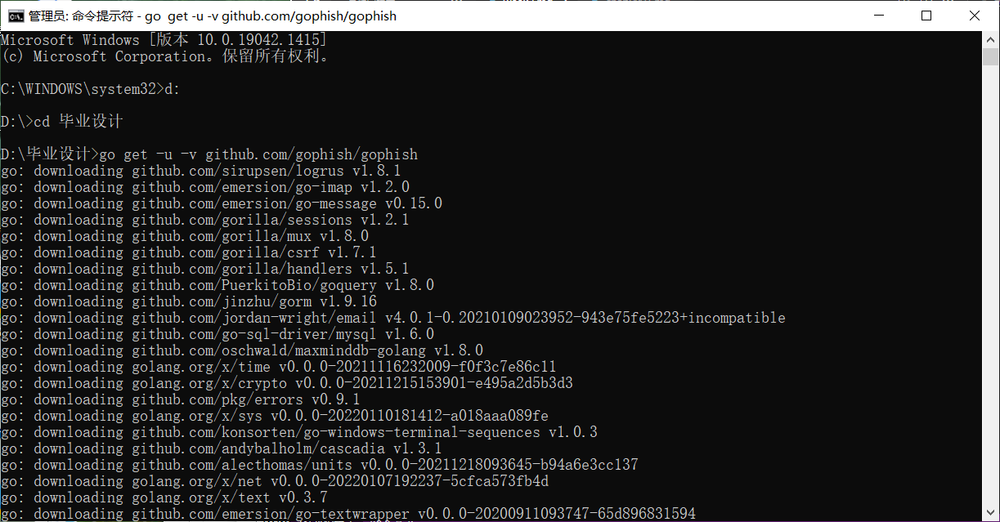
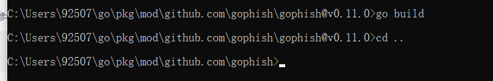
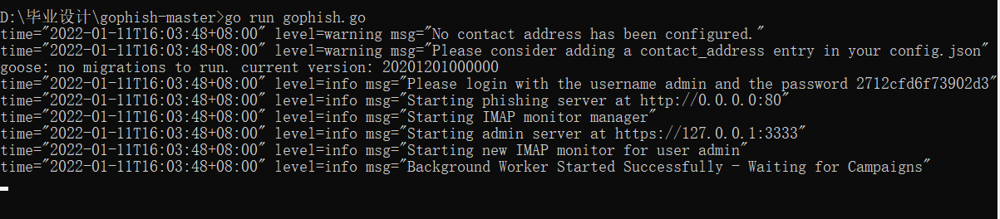
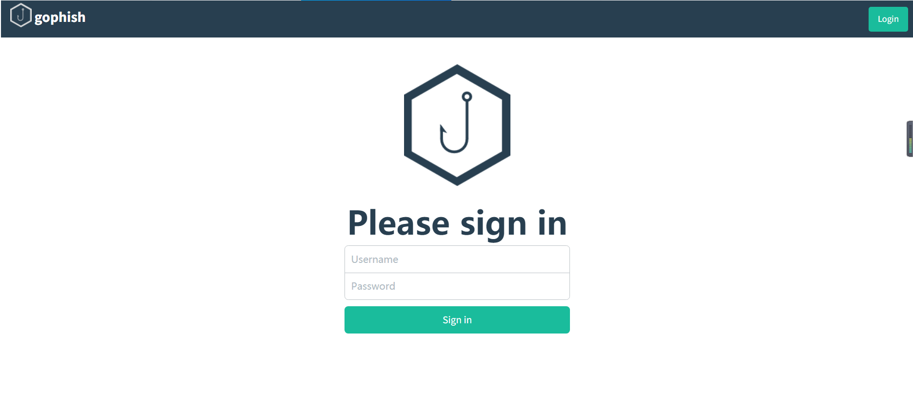

# 第二周学习记录

## GoFish库的配置

### 一.gofish库先行环境安装
#### 钓鱼框架基于go语言进行编写，需要首先配置go语言环境
- 在`https://golang.google.cn/dl/`中下载`go1.16.13.windows-amd64.msi`。


- Windows 下使用 .msi 后缀的安装包来安装，将 C:\Program Files\Go\bin 目录添加到 Path 环境变量中。


- 对安装结果进行测试
```
1.创建text.go文件代码：
package main

import "fmt"

func main() {
   fmt.Println("Hello, World!")
}
2.使用 go 命令执行以上代码输出结果
```



#### 解决gofish库安装过程中遇到的`exec: "gcc": executable file not found in %PATH%`报错所需的Gcc编译器
- 在`https://sourceforge.net/projects/mingw-w64/files/Toolchains targetting Win32/Personal Builds/mingw-builds/installer/mingw-w64-install.exe/download`点击`download`。

- 安装下载包，Architecture请选择x86_64进行安装，将安装路径对应的bin目录添加到PATH环境变量中。





- 查看是否安装成功`gcc  -v`




### 二.下载安装gophish库
- 在指定文件夹运行`go get -u -v github.com/gophish/gophish`



- 导航到`$GOPATH\github.com\gophish\gophish`下执行命令`go bulid`



- 在`gophish-master`下运行gophish.go



- 登录`https://127.0.0.1:3333`验证框架配置成功




## 遇到的问题即解决
### Q1:安装gophish库过程中go命令无法正确执行
- A1:该钓鱼框架基于go语言进行编写,需要配置go语言环境

### Q2：go环境能正确运行后遇到的`exec: "gcc": executable file not found in %PATH%`报错
- A2:需要配置解决gofish库安装过程中遇到的`exec: "gcc": executable file not found in %PATH%`报错所需的Gcc编译器。

### Q3：go get报错：`A connection attemp t failed because the connected party did not properly respond after a period of time`
- A3:go的代理网站`GOPROXY=https://proxy.golang.org,direct`是一个外网地址，国内访问不到。使用`go env -w GOPROXY=https://goproxy.cn,direct`更改代理网站，然后再重新执行go get命令即可成功download了。

### Q4:`https://127.0.0.1:3333`无法正常访问提示高危网站被拦截
- A4：网页高级设置中信任该网页。