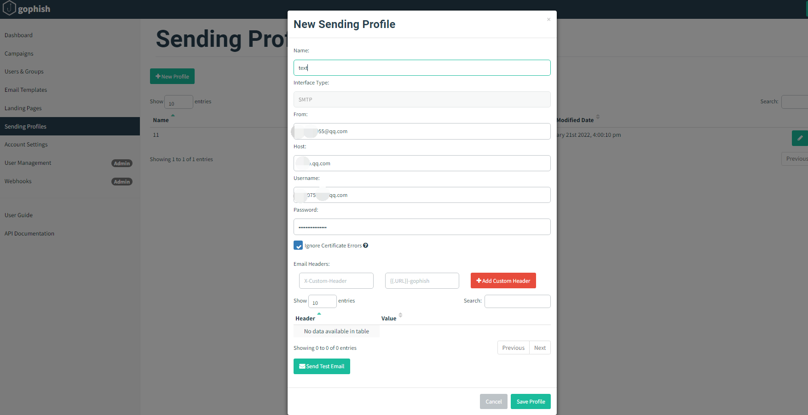
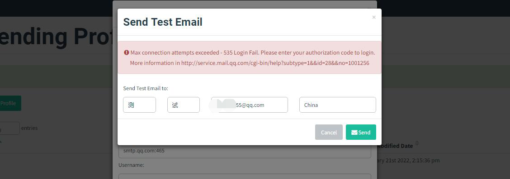

# 第三周学习记录

## 钓鱼框架 GoPhish的使用

### 一.访问后台管理系统

- 本地浏览器访问：https://127.0.0.1:3333
- 输入默认账号：输入默认账密进行登录：admin/gophish失败。
查找原因得知最新版本的gophsih(v0.11.0)删除了默认密码“ gophish”。取而代之的是，在首次启动Gophish时会随机生成一个初始密码并将其打印在终端中。

- 成功登入后台管理系统

### 二.钓鱼框架 GoFish的使用

#### 创建Users & Groups
- 用来设置你要发送邮件的收件人地址

#### 编辑email template
- 编辑邮件的内容

#### 编辑landing pages

- 编辑着陆页面内容写了一个简单的登陆窗口用来测试。

- 勾选捕获提交的数据和捕获密码，这样当受害者在钓鱼页面尝试登陆并提交信息的时候，服务器会把相关数据保存下来。

#### 编辑sending profile
- 编辑发件人的邮件

- 这里用的是QQ的邮箱（注：无论是什么类型的邮箱，首先都需要开启SMTP服务）
密码是开启smtp服务后，用于登录第三方客户端的专用密码，也就是授权码。未输入会导致错误。

- 设置成功后进行send测试，测试配置有效点击保存、

#### 编辑campaigns

- 配置发送钓鱼攻击，以及在后台进行监控

#### 受害者视角与后台展示

- 受害者的视角来看这起钓鱼攻击事件，首先是查看邮件收件列表，收到了钓鱼邮件

- 点击邮件中地址输入信息

- 后台结果展示,除此之外还能看到受害者提交的具体信息，他所使用的系统、浏览器版本等各种细节。为日后也能更好的写报告

